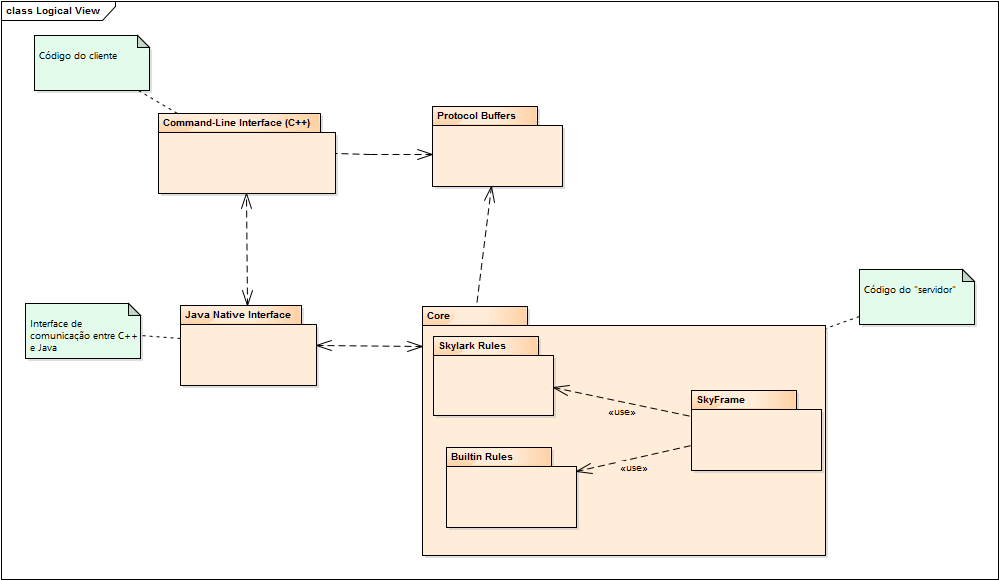
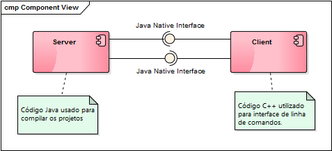
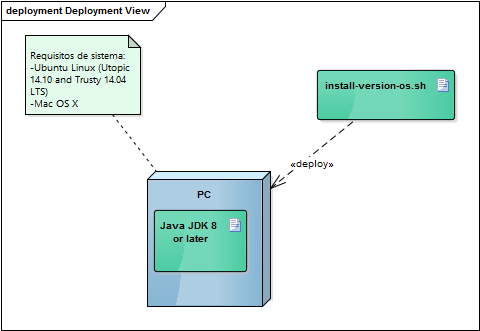

# Relatório 3 - Arquitetura de Software #

**Conteúdos**
- [Arquitetura de Software](#relatório-3---arquitetura-de-software)
	- [Introdução](#introdução)
	- [Logical View](#logical-view)
	- [Implementation View](#implementation-view)
	- [Deployment View](#deployment-view)
	- [Process View](#process-view)
	- [Referências](#referências)
	- [Contribuições](#contribuições)
	- [Autores](#autores)


## Introdução ##

A arquitetura de *software* inclui, em geral, todas as decisões importantes sobre a organização e o sistema de *software*. Os diagramas apresentam a organização fundamental do sistema, os seus componentes e as relações entre eles. Assim, é possível analisar a evolução e o desenvolvimento do projeto.

No caso concreto do Bazel, depois de uma análise rigorosa ao código disponível e à forma como ele está organizado, concluiu-se que não há uma arquitetura rigorosa e definida. Por outro lado, há claramente um propósito válido de existência e uma  aposta numa ferramenta clara e útil para diversos serviços.

## *Logical View* ##



Este diagrama, também conhecido como *UML package diagram* descreve os pacotes ou pedaços do sistema divididos em agrupamentos lógicos, mostrando as dependências entre eles. Assim, o Bazel é dividido em quatro *packages*, são eles:
* A *Command-Line Interface* contém o código do cliente, escrito em C++ , que consiste num conjunto de módulos que comunicam entre si, através de eventos e chamadas de funções.
* Os *Protocol Buffers* são uma linguagem neutra da Google, independente de plataforma e extensível para serialização de dados estruturados, semelhante ao XML, no entanto mais curta, rápida e simples. Define-se a estrutura dos dados e pode-se facilmente ler e escrever nela, através das mais diversas linguagens.
* A *Java Native interface* é responsável pela comunicação entre C++ e Java. Com esta interface é possível escrever métodos nativos para tratar situações em que a biblioteca padrão de classes Java não suporta bibliotecas ou características específicas da plataforma.
* O *Core* é constituído pelo código do "servidor", onde se inclui o utilitário SkyFrame, que usa as regras embutidas da Google e da Skylark. O SkyFrame é uma ferramenta de avaliação paralela e incremental do Bazel, que pode melhor conhecida [aqui](http://bazel.io/docs/skyframe.html).

A ligação entre os diversos pacotes é fácilmente percebida através da imagem, bem como o sentido da relação que se estabelece.


## *Implementation View* ##



Como dito nos relatórios anteriores, o Bazel é constituído por diversas linguagens de programação. Assim, do lado do cliente, isto é, a interface para o utilizador, é em linha de comandos elaborada em C++. Para comunicar com o servidor (que é a mesma máquina do utilizador) é utilizada uma [Java Native Interface](https://en.wikipedia.org/wiki/Java_Native_Interface) que vai chamar outras aplicações/linguagens (como Java) para compilar o projeto. Resumindo, o Bazel pode ser resumido a duas componentes: o servidor e o cliente. Ambas as componentes comunicam entre si sendo que no cliente é feito o pedido para compilar, esta informação é comunicada (por meio de uma interface) ao servidor que trata deste processo e devolve o resultado (novamente através de uma interface) ao cliente.

## *Deployment View* ##



Para utilizar esta *framework*, apenas precisamos de um computador cujo sistema operativo seja o Ubuntu Linux (Utopic 14.10 and Trusty 14.04) ou o Mac OS X. É necessário também que o computador tenha instalado o *Java Development Kit* (JDK) 8 ou mais recente, apesar do JDK 7 funcionar, não é recomendado.
Para instalar o Bazel é necessário correr o instalador, através do seguinte comando:
```
$ chmod +x install-version-os.sh
$ ./install-version-os.sh --user
```
A *flag*  “--user” instala o Bazel no diretório “$HOME/bin” do sistema e coloca o caminho “.bazelrc” em “$HOME/.bazelrc”. Pode-se também utilizar o comando “--help” para ver opções de instalação adicionais.  


## *Process View* ##

Visto o código deste repositório ser muito extenso, um diagrama de sequência seria muito pesado e confuso. Optou-se então por explicar o funcionamento do *Core package* do projecto. Com isto pode ter-se uma melhor percepção da vista de processos do Bazel.
### Skyframe ###
Como referido acima, a principal ferramenta utilizada pelo Bazel é o *Skyframe*. Esta ferramenta tem como objectivo analisar o código do *build request*.
Para uma melhor compreensão desta *framework* dividiu-se a mesma em 3 tópicos:
* [Modelo de dados (*Data Model*)](#modelo-de-dados);
* [Avaliação (*Evalution*)](#avaliação);
* [Incrementalidade (*Incrementality*)](#incrementalidade).

#### Modelo de Dados ####
O modelo de dados consiste num grafo contendo a relação de dependencia entre os nós. Cada nó, também denomindado de ***SkyValue***, é um objecto imutável que contém informação que já foi "construída" ao longo *build* assim como os seus *inputs* (Ex.: *input files, output files, targets* e *configured targets*). Cada nó tem um nome para o referir, sendo que este se chama ***SkyKey*** (EX.: *FILECONTENTS:/tmp/foo* ou *PACKAGE://foo*).
Para efectuar o build de cada nó tendo em conta as suas dependências é utilizada a ***SkyFunction***.
#### Avaliação ####
Uma build consiste em avaliar o nó que representa o *build request* (este é o estado que se quer atingir). Após ser encontrada a *SkyFunction*, esta é executada com a *SkyKey*. A função faz então uma avaliação dos nós que precisa para poder chegar ao estado final. Uma avaliação termina queando se chega a uma folha (geralmente representam as *input files*). No final obtemos a *SkyValue*, alguns efeitos colaterais (ficheiro de output por exemplo) e um grafo acíclico que representa a dependência dos nós involvidos na compilação.
A *SkyFunction* pode requesitar *SkyKeys* nas multiplas passagens se não conseguir determinar com antecedência todos os nós necessários. Uma função não deve aceder aos ficheiros diretamente, mas apenas através das suas dependências (desta maneira, é registada a dependência da informação que foi lida).
Em suma, esta avaliação permite:
* Hermeticidade - as funções só podem aceder à *input data* se dependerem de outros nós. Assim, é possível garantir que se a *input data* for a mesma, o resultado é o mesmo.
#### Incrementalidade ####

## Referências ##

* Página oficial: http://bazel.io/
* Estrutura do código: http://bazel.io/contributing.html
* Guia de instalação: http://bazel.io/docs/install.html

## Contribuições ##
* António Ramadas: 2 horas.
* João Guarda: 2 horas.
* Rui Vilares: 2 horas.
* Trabalho em grupo: 4 horas.

## Autores ##

Turma 1 - Grupo 4

* [António Manuel Vieira Ramadas](https://github.com/antonio-ramadas)
* [João Diogo Trindade Guarda](https://github.com/Digas29)
* [Rui Miguel Teixeira Vilares](https://github.com/RuiVilares)

[Engenharia de Software (ESOF)](https://sigarra.up.pt/feup/pt/ucurr_geral.ficha_uc_view?pv_ocorrencia_id=368707)

Faculdade de Engenharia da Universidade do Porto

31 de outubro de 2015
